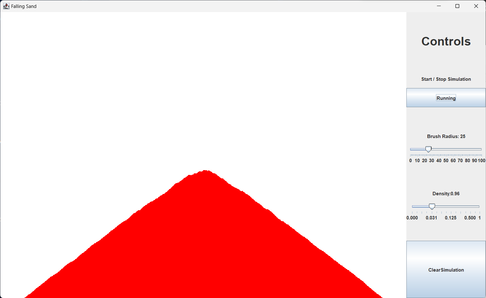

  # FallingSand   
  Simulation of falling sand by simple cellular automata rules 
  
  ## Explanation of rules
  If the cell bellow is empty, then the sand grain will fall downwards, 
  otherwise if there is free space in the diagonals to the left or right, 
  it will fall to whichever is available. 
  In case of both being free, the grain of sand will alternate directions

  ## Requirements
  This project runs on the base java swift gui. Written in java 20 environment.
      
  ## To Run
  ``
  javac FallingSand.java
  ``

  ``
  java FallingSand
  ``
  
  ## Screenshots  
    
    